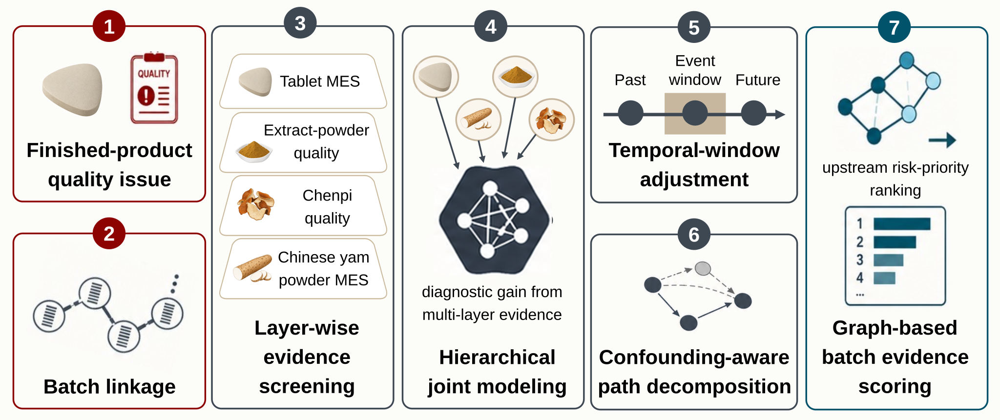

# TCM-MES Hierarchical Batch Diagnosis

Code repository for a manufacturing-execution-system (MES)-enabled hierarchical batch diagnosis framework for real-world traditional Chinese medicine (TCM) manufacturing.

This repository documents the analysis workflow used to organize quality-control records, MES production records, upstream material-quality records, process-material records, and batch-linkage information into an issue-driven diagnostic evidence chain. It is a code-only release. Raw and standardized manufacturing datasets are not included because they contain company-confidential production, quality-control, MES, and batch-traceability information.

> The associated manuscript is in preparation. Please do not cite this repository as a published study.

## Framework overview

The workflow starts from a finished-product quality issue, links downstream quality records to MES production batches, traces related records to upstream material and process-material layers, evaluates layer-wise evidence, adjusts for temporal-window effects, and generates graph-based upstream investigation priorities.

## Repository scope

Included:

- Analysis scripts for dataset overview, layer-wise description, association screening, hierarchical modeling, temporal analysis, causal-informed decomposition, and graph-based evidence scoring.
- Manuscript-supporting code for framework figures and supplementary table generation.
- Public visual summaries that show the data architecture and analysis framework.

Not included:

- Raw manufacturing data.
- Standardized analysis-ready datasets.
- Company-confidential batch-level outputs.
- Manuscript drafts or unpublished result tables.

## Repository structure

- `analysis/00_dataset_overview`: dataset dictionary and batch-linkage overview scripts.
- `analysis/01_finished_product_issue`: finished-product quality description and issue-definition scripts.
- `analysis/02_tablet_mes_description`: finished-product MES descriptive-analysis scripts.
- `analysis/03_tablet_mes_association`: finished-product MES association-screening scripts.
- `analysis/04_extract_powder_description`: Jianwei Xiaoshi extract-powder quality descriptive-analysis scripts.
- `analysis/05_extract_powder_association`: extract-powder and finished-product issue-linkage scripts.
- `analysis/06_chenpi_description_and_association`: Chenpi quality, source-code comparison, and downstream-linkage scripts.
- `analysis/07_yam_powder_description`: Chinese yam powder MES descriptive-analysis scripts.
- `analysis/08_yam_powder_association`: Chinese yam powder MES and downstream issue-linkage scripts.
- `analysis/09_issue_chain_summary`: integrated issue-chain summary scripts.
- `analysis/10_joint_modeling`: hierarchical joint-modeling and robustness scripts.
- `analysis/11_temporal_analysis`: temporal-pattern and abnormal-window assessment scripts.
- `analysis/12_causal_informed_analysis`: causal-informed path-decomposition scripts.
- `analysis/13_graph_evidence_scoring`: graph-based batch evidence scoring scripts.
- `analysis/14_framework_figures`: framework and evidence-chain figure scripts.
- `manuscript`: code utilities for manuscript-supporting documents and supplementary tables.
- `data/README.md`: local data placement and confidentiality note.

## Analysis design

The analysis is organized around an issue-driven diagnostic logic:

1. Define a finished-product quality issue as the diagnostic entry point.
2. Link finished-product quality records to MES production records.
3. Trace related batches to upstream material and process-material layers.
4. Screen candidate process and material-quality signals within each layer.
5. Evaluate diagnostic gain from hierarchical data integration.
6. Account for temporal-window effects and batch-level confounding.
7. Convert multi-layer evidence into graph-based upstream risk-priority outputs.

## Methods implemented

- Data dictionary construction and variable-level completeness summaries.
- Batch-linkage and traceability summaries.
- Layer-wise descriptive statistics.
- Spearman correlation and Wilcoxon rank-sum testing.
- Benjamini-Hochberg false-discovery-rate correction.
- Elastic-net hierarchical diagnostic modeling.
- XGBoost-SHAP nonlinear sensitivity analysis.
- Temporal-window analysis and blocked validation.
- Causal-informed path decomposition.
- Bootstrap batch-level robustness checks.
- Graph-based batch evidence scoring.

## Data availability

No raw or standardized data files are included in this repository.

Researchers who need to evaluate or rerun the full analysis may request access to de-identified or necessary analysis-ready data from the corresponding author. Access is subject to company approval, institutional permission, confidentiality review, and an appropriate data-use agreement.

## Reuse notes

The scripts are designed as a transparent workflow template. Users with authorized local data access should update input paths and variable dictionaries according to their own data structure before running the analysis.

## How to cite

Citation information will be added after manuscript publication.
